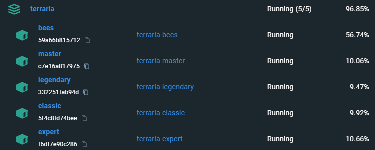

# terraria-server-farm
Docker Compose to host many worlds in a single container

# Setup

* Inspect the `docker-compose.yml` file to see if the default services suit your fancy.
* Without any changes it will start five worlds on different ports.
  - 7777 - Classic
  - 7778 - Expert
  - 7779 - Master
  - 7780 - Legendary
  - 7781 - Bees
* World files will appear in folders after starting the server.  

# Start

`docker compose up`

* The initial startup will take a long time, as five worlds will be generated simultaneously. 
  - It took my geriatric server about 10 minutes.
* Currently only x86_64 is supported.  Future versions may support ARM via mono.
* Uses the vanilla Terraria dedicated server.
* Uses a patched version of [TerrariaServerWrapper](https://github.com/joshbarrass/TerrariaServerWrapper) to provide clean shutdowns (saves and exits gracefully when docker is stopped).